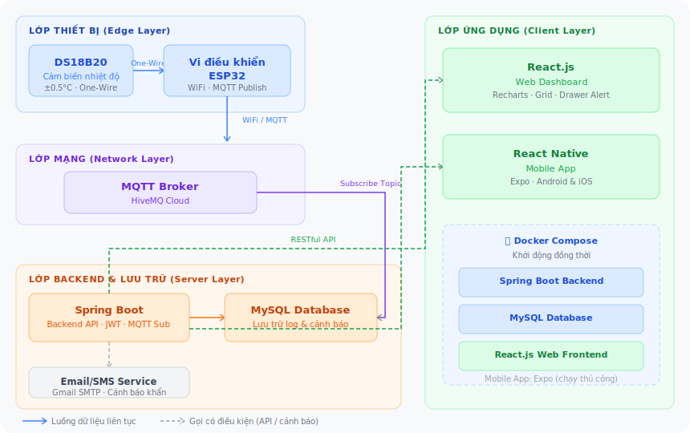

# 🏥 Hệ Thống Giám Sát Tủ Lạnh Y Tế IoT

> **Medical Fridge Monitor** — Giám sát nhiệt độ Vaccine & Sinh phẩm y tế theo thời gian thực


Hệ thống IoT toàn diện giúp **giám sát, phân tích và cảnh báo** nhiệt độ tủ lạnh bảo quản Vaccine/Sinh phẩm y tế theo thời gian thực. Dự án được thiết kế với kiến trúc phân tán, tính sẵn sàng cao và giao diện chuẩn B2B (doanh nghiệp).

---

## ✨ Tính Năng Nổi Bật

| Tính năng | Mô tả |
|---|---|
| 🌡️ **Đọc nhiệt độ chính xác** | Cảm biến DS18B20 kết nối với ESP32 qua giao thức One-Wire, đo nhiệt độ chính xác đến ±0.5°C |
| 📡 **Truyền dữ liệu qua WiFi** | ESP32 publish dữ liệu lên MQTT Broker (HiveMQ) qua WiFi, Backend tự động subscribe nhận về |
| 🚨 **Cảnh báo đa kênh** | Tự động phát hiện bất thường, gửi thông báo qua Dashboard (Web/Mobile) và Email khẩn cấp đến nhân viên y tế trực ban |
| ✅ **Xác nhận xử lý sự cố** | Nhân viên xác nhận "Đã xử lý" để đồng bộ trạng thái toàn hệ thống |
| 🧠 **Chẩn đoán thông minh** | Phân tích lịch sử nhiệt độ để cảnh báo sớm hao mòn phần cứng (yếu gas, hở gioăng, nguy cơ đóng băng sinh phẩm) |
| 📊 **Xuất báo cáo tự động** | Trích xuất báo cáo dạng CSV/Excel trực tiếp trên Web hoặc Mobile |

---

## 🏗️ Kiến Trúc Hệ Thống



---

## 🛠️ Tech Stack

| Lớp | Công nghệ |
|---|---|
| **Firmware (Edge)** | C/C++, ESP32 (Arduino framework), DS18B20 |
| **Giao tiếp** | WiFi, MQTT — HiveMQ Cloud |
| **Backend** | Java Spring Boot, Spring Security, JWT, JavaMailSender |
| **Database** | MySQL |
| **Web Frontend** | ReactJS, Recharts |
| **Mobile App** | React Native (Expo) |
| **DevOps** | Docker, Docker Compose |

---

## 📂 Cấu Trúc Thư Mục

```text
📦 iot-medical-fridge
 ┣ 📂 backend-springboot        # REST API, MQTT Subscriber, logic nghiệp vụ
 ┣ 📂 database                  # Script khởi tạo cơ sở dữ liệu (SQL)
 ┣ 📂 esp32-firmware/           # Mã nguồn C++ nạp cho vi điều khiển ESP32
 ┣ 📂 frontend-react            # Giao diện Web Dashboard (ReactJS)
 ┣ 📂 mobile-app                # Ứng dụng di động Android/iOS (React Native)
 ┣ 📄 docker-compose.yml        # Khởi động Backend + Database + Web Frontend
 ┗ 📄 README.md
```

---

## 🚀 Hướng Dẫn Cài Đặt & Chạy Dự Án

### Yêu cầu hệ thống

- **Docker** & **Docker Compose** v2+
- **JDK 17+** & **Maven** (nếu chạy Backend thủ công không qua Docker)
- **Node.js 18+** & **npm** (nếu chạy Web Frontend thủ công)
- **Node.js 18+**, **npm**, và ứng dụng **Expo Go** (cho Mobile App)
- **Arduino IDE / PlatformIO** (để nạp firmware cho ESP32)

---

### 1. Clone Repository

```bash
git clone https://github.com/Dinhthuy2k5/iot-medical-fridge.git
cd iot-medical-fridge
```

---

### 2. Cấu Hình Môi Trường Backend

Chỉnh sửa file `backend-springboot/src/main/resources/application.properties`:

**Cấu hình MySQL:**
```properties
spring.datasource.url=jdbc:mysql://localhost:3306/medical_fridge_db?useSSL=false&serverTimezone=UTC
spring.datasource.username=root
spring.datasource.password=YOUR_DATABASE_PASSWORD
```

**Cấu hình MQTT Broker:**
```properties
mqtt.broker.url=tcp://broker.hivemq.com:1883
mqtt.topic=medical/fridge/temperature
```

**Cấu hình Gmail SMTP** (yêu cầu [App Password](https://myaccount.google.com/apppasswords) 16 ký tự):
```properties
spring.mail.host=smtp.gmail.com
spring.mail.port=587
spring.mail.username=your_email@gmail.com
spring.mail.password=xxxx xxxx xxxx xxxx
spring.mail.properties.mail.smtp.auth=true
spring.mail.properties.mail.smtp.starttls.enable=true
```

---

### 3. Khởi Động Backend + Database + Web Frontend (Docker Compose)

Docker Compose sẽ khởi động cùng lúc: **Spring Boot Backend**, **MySQL Database** và **Web Frontend**.

```bash
docker-compose up -d
```

| Service | URL |
|---|---|
| Web Dashboard | `http://localhost:3000` |
| Backend API | `http://localhost:8080` |
| MySQL | `localhost:3306` |

Xem log:
```bash
docker-compose logs -f
```

Dừng tất cả:
```bash
docker-compose down
```

---

### 4. Chạy Backend Thủ Công (Không Dùng Docker)

> Yêu cầu MySQL đang chạy sẵn ở bước trước.

```bash
cd backend-springboot
mvn clean install
mvn spring-boot:run
```

Backend chạy tại: `http://localhost:8080`

---

### 5. Chạy Web Frontend Thủ Công (Không Dùng Docker)

```bash
cd frontend-react
npm install
npm start
```

Web Dashboard chạy tại: `http://localhost:3000`

---

### 6. Cài Đặt & Chạy Mobile App (React Native + Expo)

Mobile App chạy **độc lập** ngoài Docker thông qua nền tảng Expo.

**Bước 1:** Di chuyển vào thư mục mobile app
```bash
cd mobile-app
```

**Bước 2:** Cài đặt dependencies
```bash
npm install
```

**Bước 3:** Cài thêm các Expo package hỗ trợ xuất file và chia sẻ
```bash
npx expo install expo-file-system expo-sharing
```

**Bước 4:** Cấu hình địa chỉ IP Backend

Mở file `app/(tabs)/components/Dashboard.tsx`, tìm hằng số `SERVER_IP` và cập nhật địa chỉ IPv4 LAN của máy đang chạy Backend:
```typescript
const SERVER_IP = '192.168.x.x'; // Thay bằng IP LAN thực tế của bạn
```

**Bước 5:** Khởi động Expo
```bash
npx expo start
```

**Bước 6:** Mở app trên điện thoại

> ⚠️ Đảm bảo điện thoại và máy tính đang **cùng một mạng Wi-Fi**.

- **Android:** Mở ứng dụng **Expo Go** → chọn *Scan QR Code* → quét mã QR hiển thị trên Terminal
- **iOS:** Dùng **Camera** mặc định quét mã QR → bấm link mở trong **Expo Go**

---

### 7. Nạp Firmware ESP32

**Bước 1:** Mở thư mục firmware trong Arduino IDE hoặc PlatformIO
```bash
cd esp32-firmware
```

**Bước 2:** Cấu hình thông tin WiFi và MQTT trong file `config.h` (hoặc đầu file `.ino`):
```cpp
#define WIFI_SSID     "your_wifi_name"
#define WIFI_PASSWORD "your_wifi_password"
#define MQTT_BROKER   "broker.hivemq.com"
#define MQTT_PORT     1883
#define MQTT_TOPIC    "medical/fridge/temperature"
```

**Bước 3:** Kết nối ESP32 với máy tính qua USB, chọn đúng cổng COM, rồi nạp firmware.

---

## 📸 Giao Diện

> *(Thêm ảnh chụp màn hình Web Dashboard và Mobile App vào đây)*

---

## 👥 Nhóm Phát Triển

| Họ và tên | MSSV | Vai trò |
|---|---|---|
| Nguyễn Đình Thủy | 20235437 | Full Stack Developer |

**Môn học:** Project 2 — Trường Đại học Bách Khoa Hà Nội

---

## 📄 License

Dự án được phát triển cho mục đích học thuật — Project 2, HUST.